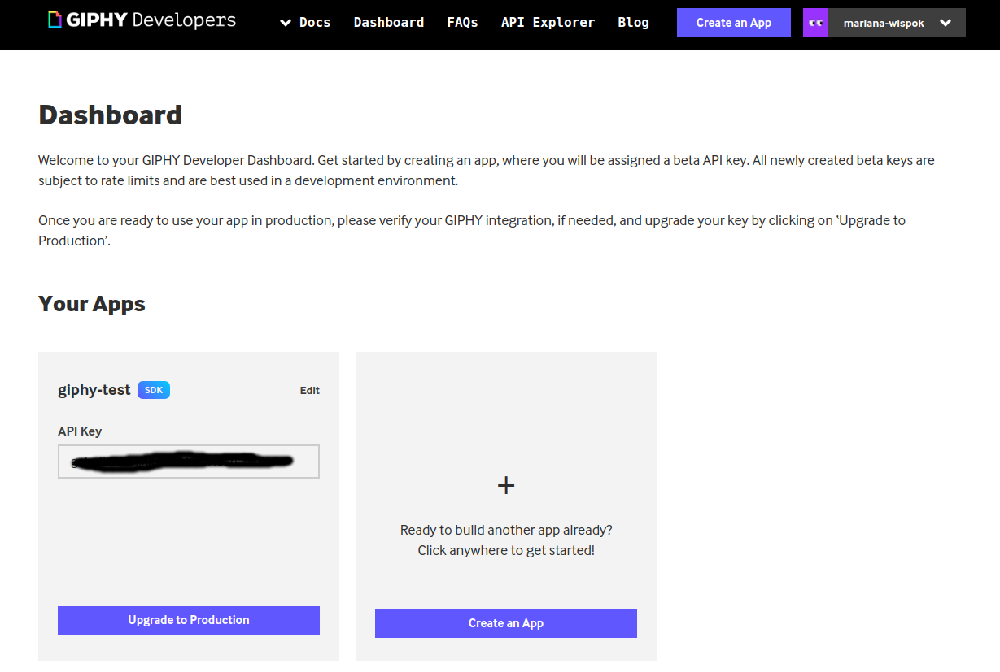

# Frontend Hello World Project

## Objective

Your task here is to create a web app to visualize 5 gifs from GIPHY every time you refresh the browser.

You will need: 

- a GIPHY api key. You can get it by creating an account [here](https://developers.giphy.com/), then create an app with the SDK plan (free) and you will see this screen with your api key.

## Requirements

We encourage you to use:

- a public git repository to store your app

- React components

- NPM for your dependency management

Note: have a README.md file with the **set up instructions and version requirements** in your repository so that we can understand how to run your code.

## Share Points

Let us know when you're finished by sending us the link to your repository where the app is stored.